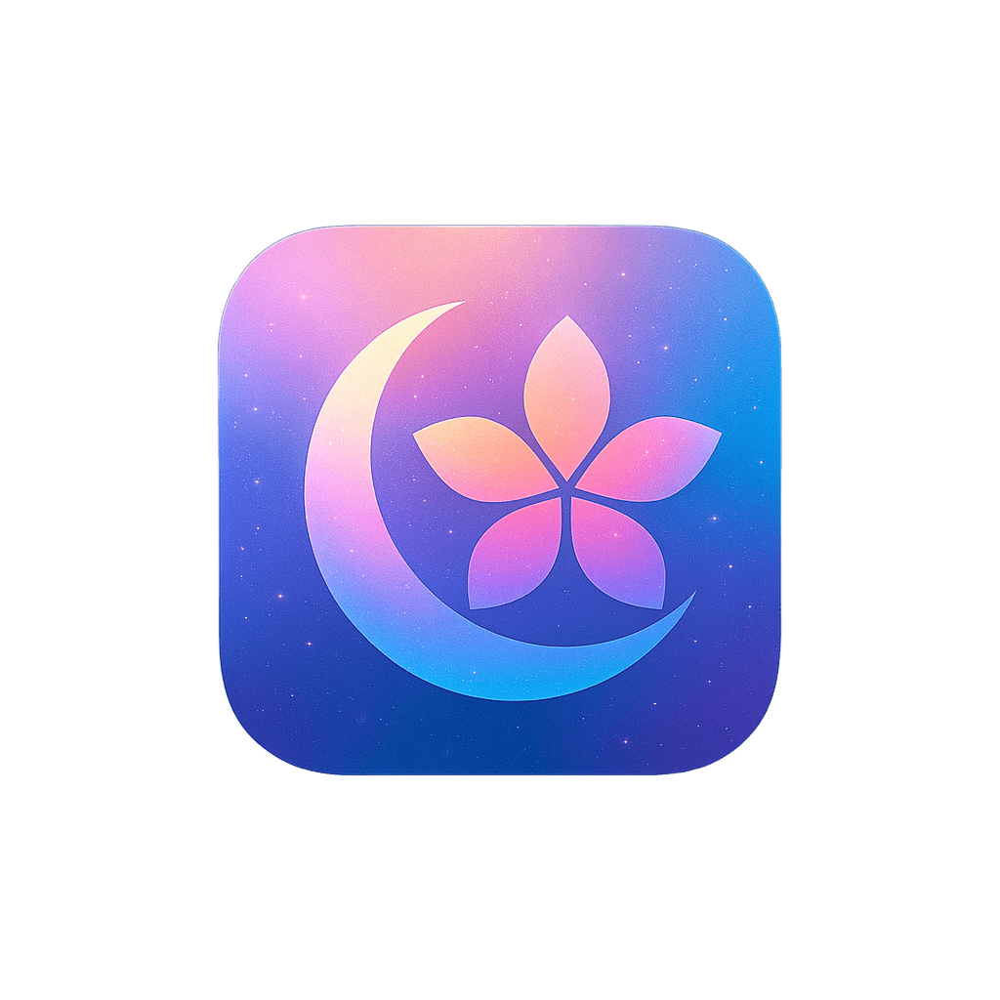

  

<h1 align="center">mugen-shell</h1>

<i>A 夢幻 desktop, built on Quickshell + Hyprland.</i>

https://github.com/user-attachments/assets/c91027d3-c49d-43a3-86a9-6554ac110a6c

> Personal dotfiles, packaged so others can try them via Nix flake or a plain Makefile.

For directory layout, install paths (Nix flake home-manager module or manual `make install`), dependencies, and keybindings see [SETUP.md](SETUP.md).

---

## Environment

| | |
|---|---|
| OS | Garuda Linux (Arch-based) |
| GPU | AMD Radeon RX 9070 XT |
| WM | Hyprland |
| Shell | Zsh + Starship |
| Terminal | Kitty |
| Desktop Shell | Quickshell |
| Wallpaper | awww / mpvpaper |
| Colors | Matugen (Material You) |

---

## AI Assistant

https://github.com/user-attachments/assets/a2b8a7a9-0899-45e3-9dce-c896f49f35f7

AI chat panel (`Super + A`) powered by **mugen-ai** — a Go server bundled in this repo under [`ai/`](ai/), supporting local [Ollama](https://ollama.com) models and Google Gemini.

Built and enabled automatically on either install path (Nix flake or `make install` — see [SETUP.md](SETUP.md)).

- Streaming SSE responses with stop button
- Runtime model switching from the UI
- Welcome screen with suggestion chips
- Multiline input (Shift + Enter)
- Copy button per message
- Smart auto-scroll
- BlobEffect breathing indicator
- Configurable personality and real-time context injection (date/time, weather)

Configuration, the HTTP API, and the Gemini API key step live in [SETUP.md → Configuring mugen-ai](SETUP.md#configuring-mugen-ai).

---

## Preview

[TikTok demo — @ripnk6498](https://www.tiktok.com/@ripnk6498/video/7579183858038492433?is_from_webapp=1&sender_device=pc)

---

## Features

- Wallpaper-driven Material You color scheme via Matugen
- Video and image wallpaper switching (mpvpaper + awww)
- Wallpaper picker UI
- Music player integration (playerctl / MPRIS) with YouTube thumbnail fallback and a seekable glowing progress slider
- Cava audio visualizer
- Notification center
- Calendar widget
- Clipboard history (`Super + V`) with item limit
- WiFi / Bluetooth / IME management
- Speaker / microphone control sharing the volume panel (`Super + U`) with a swap toggle
- System Tray (collapsible)
- Battery indicator (water-level fill inside the power menu icon, opt-in)
- Idle inhibitor toggle
- App Launcher (`Super + R`)
- Screenshot capture with clipboard copy (`Super + F12`)
- Screenshot gallery
- Power menu
- In-shell settings panel

---

## Usage

Once installed (see [SETUP.md](SETUP.md)), the bar starts via Hyprland's `exec-once`.

Most-used panels:

| Key | Action |
|---|---|
| `Super + R` | App launcher |
| `Super + W` | Wallpaper picker |
| `Super + M` | Music player |
| `Super + U` | Volume / mic control |
| `Super + V` | Clipboard history |
| `Super + T` | Notification center |
| `Super + A` | AI assistant |
| `Super + S` | Screenshot gallery |
| `Super + L` | Power menu |
| `Super + ,` | Settings |

Right-click the power menu icon to jump straight into settings. Click the chevron next to the notification icon to expand the system tray. Full keybind list lives in [SETUP.md](SETUP.md).

---

## License

MIT License
