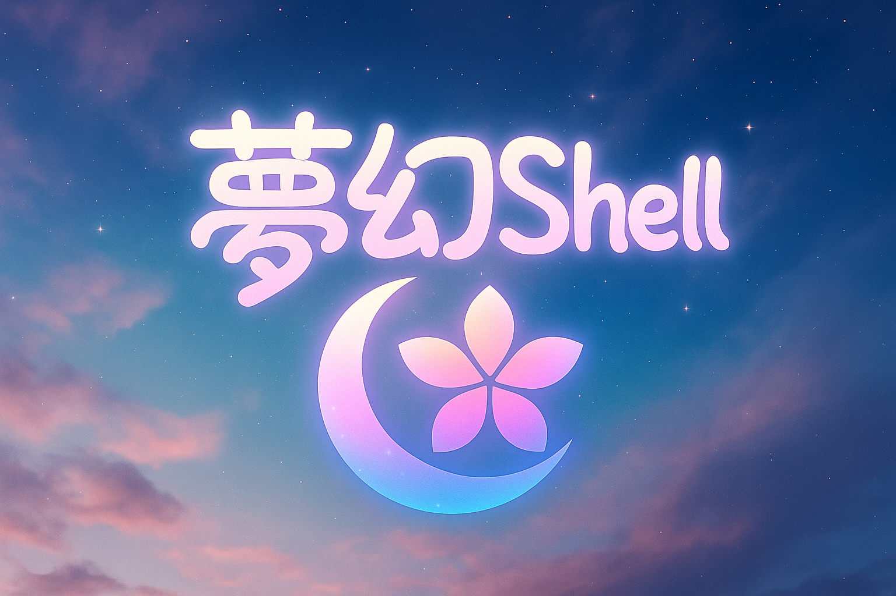

# mugen-shell

Built with **Quickshell + Hyprland**.

---

## Environment

| | |
|---|---|
| OS | Garuda Linux (Arch-based) |
| WM | Hyprland |
| Shell | Zsh + Starship |
| Terminal | Kitty |
| Browser | Zen Browser |
| Shell UI | QuickShell |
| Wallpaper | swww / mpvpaper |
| Colors | Matugen (Material You) |

---

## CLI

Hyprland keybinds and shell control are managed via **[mugen-ctl](https://github.com/tmy7533018/mugen-ctl)**, a companion Go CLI tool.

---

## Preview

[TikTok demo — @ripnk6498](https://www.tiktok.com/@ripnk6498/video/7579183858038492433?is_from_webapp=1&sender_device=pc)

---

## Features

- Wallpaper-driven Material You color scheme via Matugen
- Video and image wallpaper switching (mpvpaper + swww)
- Music player integration (playerctl / MPRIS)
- Cava audio visualizer
- Notification center / Clipboard history
- WiFi / Bluetooth / IME management
- App Launcher / Window Switcher
- Screenshot gallery
- Power menu

---

## License

MIT License
