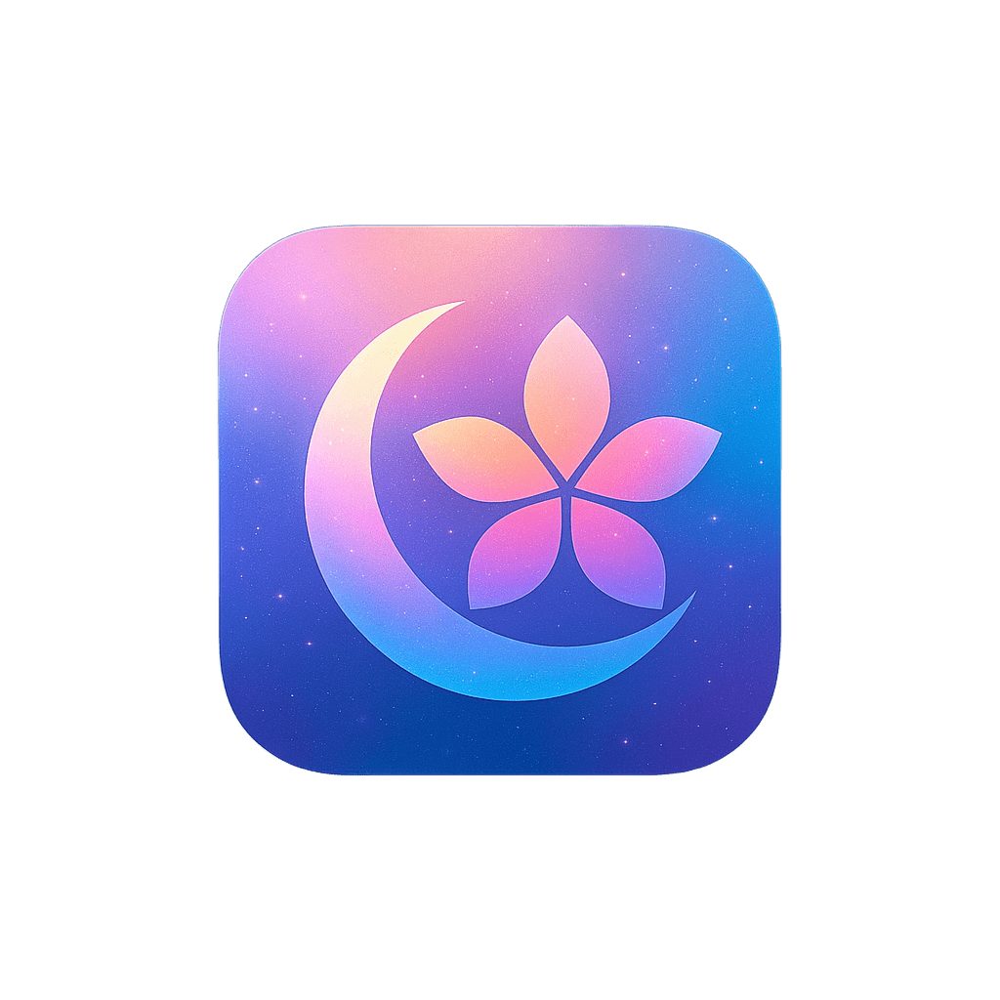
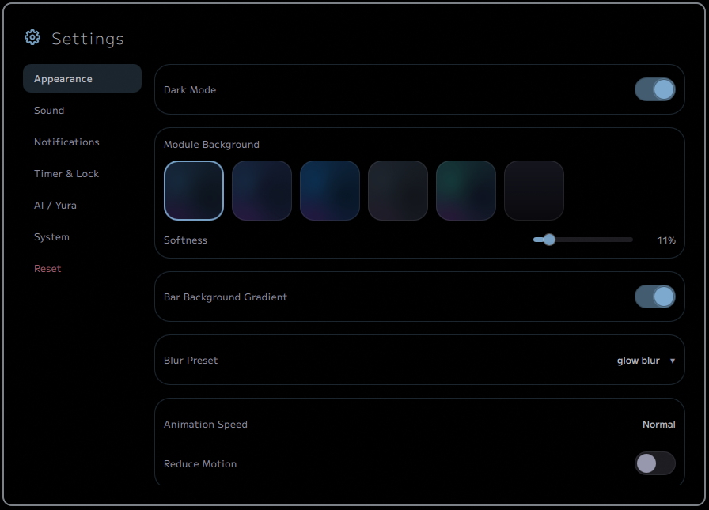
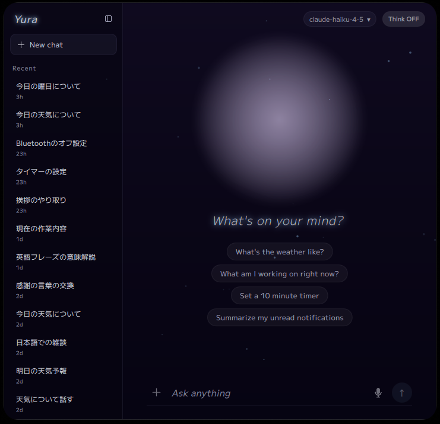

<p align="right"><a href="README.en.md">English</a> | <b>日本語</b></p>

<h1 align="center">
  <br/>
  mugen-shell
</h1>

<p align="center"><i>Quickshell + Hyprland で組んだ、夢幻シェル。</i></p>

https://github.com/user-attachments/assets/375659b6-8b1d-4d08-8621-7451d6791e71

Hyprland + Quickshell デスクトップ向けの私の dotfiles を、Nix flake または `make install` で入れられる形にまとめたものです。

---

## 機能

- 日常のためのパネルが揃っています — カレンダー、タイマー、音楽、クリップボード、通知、アプリランチャー、スクリーンショット
- 壁紙は画像・動画に対応しており、滑らかなトランジションで切り替わります。
- 壁紙からカラーパレットをいくつか生成します。選択したカラーパレットをデスクトップに配色します。
- ひととおりのシステム操作ができます — オーディオ、バックライト、WiFi、Bluetooth、IME、バッテリー、システムトレイ
- デスクトップのアシスタント Yura に、チャットや音声で話しかけられます。
- 全体がなめらかなアニメーションで動きます。アニメーションは簡単なカスタマイズができます。
- Settings ウィンドウでいろいろな設定を変更できます。

<details>
<summary>Settings ウィンドウ</summary>



</details>

---

## Yura

Yura はデスクトップのアシスタントです。バーの入力 (`Super + Y`) と画面コーナーのチャットパネル (`Super + Shift + Y`) の 2 か所で使用できて、会話履歴は共有されます。バックエンドは [`ai/`](ai/) 配下の Go サーバ **mugen-ai** で、[Ollama](https://ollama.com) 経由のローカルモデル、Anthropic Claude、Google Gemini、OpenAI 互換 API に対応しています。メッセージにはファイルを添えられます。

Yura はデスクトップの操作も可能です。「音量 30 にして」「5 分タイマー計って」と言えば、自分でクリックするのと同じパネルに届きます。危険な操作はしません。外部の [MCP](https://modelcontextprotocol.io) サーバにも対応しており、書き込み系は実行前に確認します。

音声入力はボタンやプッシュトークでできます。`Super + Z` を押しながら話すと、返事は音声モデルが読み上げます。既定の声は日本語です。[AivisHub](https://hub.aivis-project.com/) のモデルをインストールして Settings で選べます。詳細は [SETUP.md](SETUP.md#mugen-ai-の設定) にまとめました。

<details>
<summary>Yura のチャットパネル</summary>



</details>

---

## インストール

インストールせずに試すならデモ VM が使えます。Hyprland に自動ログインします (資格情報は `mugen` / `mugen`):

```sh
cd nixos && nix build .#nixosConfigurations.vm.config.system.build.vm && ./result/bin/run-mugen-vm-vm
```

各設定項目はすべて [SETUP.md](SETUP.md) にまとめました。

---

## クレジット

mugen-shell は [Hyprland](https://hyprland.org/) と [Quickshell](https://quickshell.outfoxxed.me/) をはじめ、多くのプロジェクトの上に成り立っています。全リストは [SETUP.md → クレジット](SETUP.md#クレジット) にあります。

---

## ライセンス

MIT License
